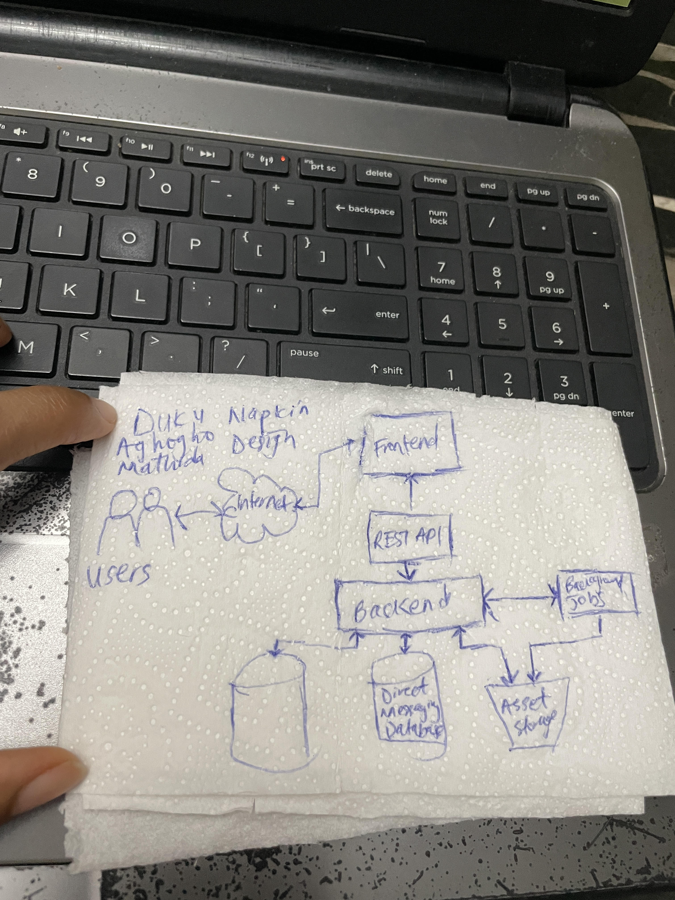

# Week 0 — Billing and Architecture

## Required Homework

### Recreate Conceptual Diagram
The 
[Crudder Conceptual Diagram](https://lucid.app/lucidchart/2a31063f-fb4d-43ac-9007-02462ea2bfb1/edit?viewport_loc=-2206%2C-1356%2C2650%2C1038%2C0_0&invitationId=inv_9817bc8b-87b1-4fd4-8e81-3145d5cbb469) I created on lucid chart is displayed below, alongside the conceptual diagram I created on a napkin.

### Recreate Logical Architectual Diagram

The [Crudder Logical Architectual Diagram](https://lucid.app/lucidchart/b6a3dc1e-dec4-45fa-a263-15fa7aadaaf2/edit?viewport_loc=-868%2C-726%2C2650%2C1038%2C0_0&invitationId=inv_5fc2cd8e-458f-42a5-a33b-80d61041196a) I created on lucid chart is displayed below

In this week, I also installed AWS CLI, learnt about creating a billing alarm and a budget via the CLI. I learnt about utilizing cloud shell.