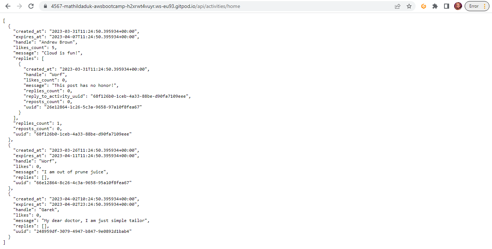

# Week 1 — App Containerization

## Required Homework
### Watched Week 1 - Live Streamed Video
- I learnt how to build images. Got to understand the concept of layers in containerization. Scratch is an official docker image which basically means an empty image, it can be used as a starting point to build other images such as debian which is a base image.
- To build an image, create file called Dockerfile (where we will put our docker configuration)
- When creating a docker file you have 

`FROM <ImageName>`

The `FROM` signifies the base image we are working with as docker files are built in layers

`WORKDIR /backend-flask` 

`WORKDIR` is almost like the home directory that comes up when you log into your terminal. In this case you are basically saying create this directory in the container and this is where we will be working, anything after this (i.e the commands) should be run in this directory.

`COPY requirements.txt requirements.txt`

`COPY` copies files from the host machine and places it in the container, the first is for the host and the second is for the container

`ENV FLASK_ENV=development`

`ENV` stands for environmental variable, this is important for the configuration of your application
- I learnt how to start a container. A container is simply an image that is running. 
- Made use of the docker extension in vscode which shows you the containers running and images available. Learnt how to go directly into the container using vscode by right clicking and selecting attach shell this is helpful for debugging. You can acheive the same thing via the command line using the command `docker exec CONTAINER_ID -it /bin/bash` .
- Learnt some docker commands
`docker image`
`docker build <image-name> -t`
`docker run <image-name>`
`docker run--rm -p <host-port-number>:<container-port-number> -d <image-name>`
`docker run --rm -p <host-port-number>:<container-port-number> -it <image-name>`

- ./ means current directory in vscode 

- tag `-t` in docker refers to name:tag if a tag is not specified it defaults to latest. An image having the "latest" tag doesnt necessarily mean it is the latest version of that image
- You can set the environmental variables in your host system and when you run the `docker run` it is able to use the variables set in the host system. Alternatively, you can pass the environmental variables along side with the `docker run` command using the flag `-e`
- Adding the flag `--rm` to your docker run command tells docker to delete the container once you decide to stop it. 
- If `--rm` is not added and the container is stopped, it will be in an exited state, and you can view it using the `docker ps -a` command, but you won't see it using the `docker ps` command because this command is only displays running containers.
- The flag `-d` stands for detached mode, which in real life you would be using more frequently. The container would be running in the background.
- The flag `-it` stands for interactive mode.
- The flag `-p` stands for port number. This exposes a specfic port on the host and container. Note to unlock the ports on vscode to enable you view your application.
- Docker compose is used to run multiple containers at a time. It saves you the stress of typing multiple commands in the command line and simplifies everything in a YAML file. To run the containers use the command `docker compose up` 
- `docker-compose up` runs it as an executable, both works!!
- Volumes can be used to mount and serve as a middle ground between the host and the container.
```YAML
volumes:
      - ./frontend-react-js:/frontend-react-js`
```
The above code mounts the frontend-react-js directory in the host machine to the frontend-react-js directory in the container. If changes are made in this directory on the host machine, it reflects on the container directory and subsequently on the application running on the container. This mounting allows for persistent data, so even if the container is stopped or deleted, the data in that directory can still be accessed on the host machine. 

### Container Security Considerations
- Learnt the importance of container security.
- Using a managed container service such as aws ecs, eks, e.tc is easier than using unmanaged container services i.e doing it by yourself, this is because the bulk of the work is handled by these cloud services e.g maintaining the server. On the other hand, using unmanaged container services gives you the flexibility to make certain configuration changes that you wont be able to do with cloud services. Using cloud services is like a high level way of doing things so you can focus on what is important and be able to scale properly. Making the decision depends on what your overall goals are and the budget you have for the project. In my opinion, using cloud services is the way to go when it comes to container security because you have so many things to look after and you might miss some vulnerabilities in your infrastructure, deployment and application as a whole, which these cloud servies can identify for you. 
- Container registry is where container images are stored, could be public e.g docker hub or private. Images can be pushed or pulled in this registry.
- Most companies have their own private registry where their images are stored, this enables them properly test for security vulnerabilities and loopholes before releasing a version out for the public.
- You can use Synk, an open source tool to scan your container for vulnerabilities.
- Docker Compose can only build ONE application. It is hard to carry out auto-scaling with docker compose that is where using managed container services also have an edge.

#### AWS Container Services
1. AWS ECS
2. AWS EKS
3. AWS App Runner
4. AWS Fargate
5. AWS Copilot

#### Advantages of using managed container services
1. Auto-scaling
2. Automation
3. Zero downtime
4. Easy integration and synchronization with other cloud services

#### Things to consider pertaining container security (Best practices)
1. Docker and host configuration
- Keep the host and docker updated to latest security patches.
- Docker daemon and containers should run in non-root user mode. This will prevent any intruder from having priviledges that will compromise the project.
2. Securing images
- Image Vulnerability Scanning e.g AWS Inspector, Clair. This allows you to check your images for vulnerabilities so you can correct them and ensure high security. Your images should ONLY have things that will make the application run effectively. This makes the images lightweight so it can be easily brought up and down depending on your needs. 10MB is a good size. 
- Trusting a Private vs Public Image Registry. For learning purposes, you can use a public registry. When in a company and you're more security conscious, its best to use a private registry.
3. Secret Management
- No sensitive data in docker files or images
- Use secret management services e.g Hashicorp Vault, AWS Secret Manager to share secrets
4. Data Security
- Use Read-Only file system and volume for docker. In the event your files get in the wrong hand, you dont want the perpetrators to be able to make changes that can be detrimental. For example, doing a container escape and since some files are in the container are attached to files in your host system, this can lead to a serious data breach.
- Use Separate databases for long term storage e,g AWS RDS, DynamoDB. It is recommended to limit long term storage on the docker container itself.
5. Application security / Monitoring containers / Compliance Framework
- Use DevSecOps practices while building application security.
- Ensure all code is tested for vulnerabilities before production use.

### Containerize Application (Dockerfiles, Docker Compose)
- Successfully built images for the frontend and backend part of the app.
- Ran containers for the images and the applications were up and running.
- A docker compose file was created so the containers would run side by side and they well worked together.




### Write a Flask Backend Endpoint for Notifications


### Write a React Page for Notifications


### Run DynamoDB Local Container and Run Postgres Container


## Homework Challenges
- I built my portolio website and made an image out of it.
- I pushed it to dockerhub


- I installed docker on my local machine
- I ran all the containers on my local system 


