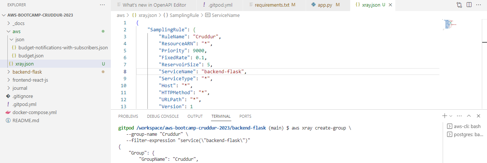

# Week 2 — Distributed Tracing

## Required Homework

### Watch Week 2 Live-Stream Video

This week i got to learn about open telemetry and distributed tracing. These concepts help in understanding and troubleshooting complex computer systems. Open telemetry is a tool/framework that helps developers collect and analyze data from different parts of their computer systems, servers, etc. It provides a set of APIs and SDKs that allow developers to instrument their apps and services to capture telemetry data e.g metrics, traces and logs. Distributed tracing is one of the telemetry data types that can be collected and exported by open telemetry.  Logging, metrics, tracing; they all link together but they are different in their own ways.

Instrumentation is adding code to your app to collect data, telemetry is collecting that data and transmitting the data to a monitoring system, tracing is receiving that data for analysis to tell a story that can easily be interpreted and used to troubleshoot.

### Watched Ashish's Week 2 - Observability Security Considerations

OBSERVABILITY VS MONITORING
- They are both used for monitoring and managing the health and performance of complex systems but they still have their differences.

- Monitoring just shows you something went wrong observability trys to help you understand WHY that thing went wrong by giving you deeper insights into the thing.

- Monitoring involves setting up alerts and notifications to let you know when certain thresholds are exceeded or when particular events occur. 

- Observability is more about understanding what is happening inside the system than simply tracking metrics or indicators. It involves collecting data from a wide range of sources and using that data to gain a holistic understanding of the system's behavior.

- Monitoring is focused on tracking specific metrics and indictators to detect issues as they arise, while observability is focused on gaining a deep understanding of the system's behavior and using that understaning to detect and diagnose issues.

- Monitoring is watching to see when problems come, observability is underatsnding the inside of a system to identify and fix problems. From the data you get from observaility you can be able to know the root cause of issues by analyzing data in real time not just metrics with no added context. 

- Monitoring tools focus on collecting data from specific sources and alerting when those sources indicate an issue. Examples include; rollbar, prometheus, grafana. 

- Observability tools take a broader approach, collecting and analyzing data from multiple sources (e.g logs, metrics, traces) to provide a more complete picture of system behavior and performance. By collecting and analyzing this information, you gain a detailed understanding of how different parts of the system are interacting and where issues may be occuring. Examples include; Honeycomb, AWS X-Ray

### Instrument Honeycomb with OTEL
Instrumentation is the process of adding code to your software application to collect data about how its behaving at runtime. Distributed tracing is a technique for collecting and analyzing telemetry data from distributed systems. It traces the flow of requests across multiple components and services. You can be able to trace the path of a request. it also provides information about the performance of each component and the communication between them. It is usually integrated with other monitoring and observability tools to provide a comprehensive view of system performance and health. Some monitoring systems have built-in support for distributed tracing, allowing developers to use distributed tracing to collect telemetry data from their systems. 
Honeycomb is specialized for their feature of distributed tracing. It also provides features for logging and metrics analysis. You can be able to trace the beginning of a request to the end of the request. Once a user sends a request and there's an error, how do you know which one is the error? How do you now know where the error is coming from? Is it from the database, is it from the web server? So honeycomb would show you the trace how it's moved from components to component from database to web server, etc. Honeycomb would give you this full story, how it traveled from the beginning of the request to the end of the request. And when you can be able to see that tracing, when you can be able to see that story, you can be able to know where the error is coming from. Honeycomb allows developers to quickly identify the root cause of issues. It tracks the path of requests as they move through complex systems, identify performance bottlenecks, and troubleshoot issues quickly. Honeycomb analyzes log data, metrics and other telemetry data to provide a complete picture of system behavior.

<b>NOTE:</b>  You dont want the honeycomb service name to be consistent between multiple services(e.g backend service), so its best the variable is hardcoded in your docker file than exported in your terminal as an environmental variable

1. set environmental variable for honeycomb api keys
2. add otel env variables to docker compose file
3. Add opentelemetry dependencies to backend requirements.txt

### Instrument AWS X-Ray

AWS X-Ray enables developers trace requests as they flow through differnt components of a system, visualize the relationship between different services and identify performance bottlenecks and errors. It provides a comprehensive view of requests as they flow through a distributed system, making it easier to identify and diagnose issues that may be affecting application performance or reliability.

### Configure custom logger to send to CloudWatch Logs

Amazon CloudWatch Logs is used to collect and monitor log data from multiple sources in a centralized location, making it easier to troubleshoot issues and perform root cause analysis. It offers real-time monitoring of logs, log analysis and visualization. It is used to generate graphs and charts that provide a visual representation of log data over time, allowing users to gain insights into system performance and behavior.

### Integrate Rollbar and capture and error

Rollbar specializes in error tracking. Once your application is running, the minute you have an error, rollbar will give you a visual of that error, from there you can be able to try to troubleshoot where the problem is and it makes your life a whole lot easier because you can do it from anywhere. Rollbar is also capable of monitoring and alerting for other types of events, such as log data and performance metrics. Rollbar provides real-time alerts when new errors are detected and offers features for debbuging errors directly in the platform. It collects and aggregates error data from different parts of an application, such as front-end and back-end components, and provides a centralized platform for developers to investigate and resolve errors.

