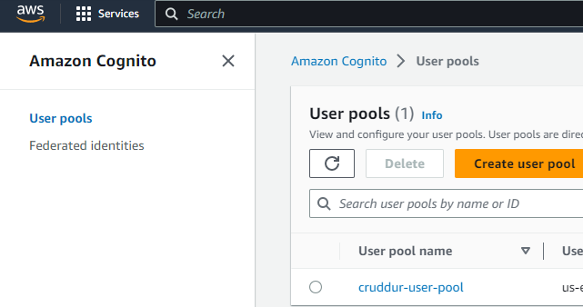
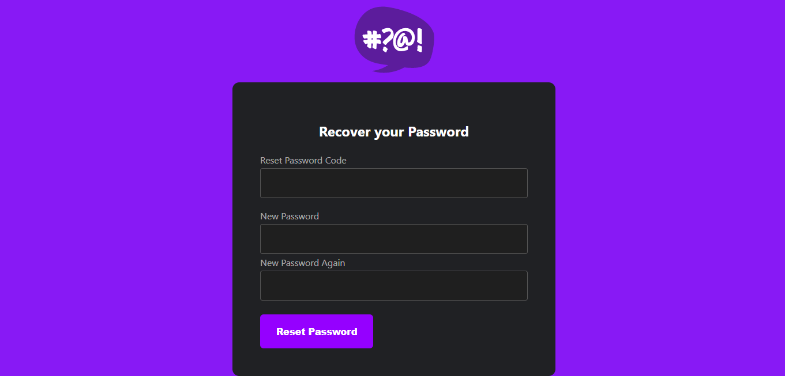

# Week 3 — Decentralized Authentication

## Required Homework

### Watched Ashish's Week 3 - Decentralized Authentication

Types of Authentication systems
1. Traditional Authentication: where you have username and password or a physical access card used in offices
2. SAML (Security Assertion Markup Language): Allows you have a single point of entry into any application e.g face ID using one credential to go into any app you want
3. OpenID connect: Allows you to use your social credentials (e.g facebook, google, apple ) to sign up for an application. You dont have to remember the passwords for different application because your social credentials will be sufficient to authenticate you. This type doesnt do authorization it ONLY does authentication. For authorization OAuth 2.0 is used.
4. OAuth: It is an authorization system that is used in conjunction with OpenID. There is an exchange of token that allows users to login and authorize access for apps to do certain things such as giving instagram access to post on your facebook. 

<b>DeCentralized Authentication</b>
Storing your username and password in one place you want it to be stored then authorizing other applications to be able to access those services

<b>Amazon Cognito</b>
It is a service which allows authentication with users that it stores locally in the amazon account. It is a user directory with the context of amazon web services. When you build your application, you want a place to store the usernames and passwords of your users so when they log in again it can easily be retrieved from that directory to use to authenticate the user, thats what amazon cognito does.

<b>Types of Amazon Cognito</b>

1. Cognito User Pool: This will ONLY allow the user access to the application itself
2. Cognito Identity Pool: This allows an application request for temporary credentials to allow access to services within AWS

<b> Why use Amzon Cognito</b>

1. User Directory for Customers
2. Ability to access AWS Resources for the application being built
3. Identity Broker for AWS Resources with the Temporary credentials
4. Can extend users to AWS Resources easily

<b> User Lifecycle Management </b>
Provisioning into the system -> Enforce policies -> Update policies -> Offboard

<b>Token Lifecycle Management</b>
Token is shortlived and is used to give short term authentication and authorization

Token Creation -> Token Assignment -> Token Activation -> Token Suspension -> Token Removal -> Token Expiration

<b> Amazon Cognito Security Best practices - AWS </b>

1. Be mindful of what AWS services is allowed to have access to the user pool.
2. Use AWS WAF (Web Application Firewall). It has features such as Rate Limiting (i.e Limiting the number of requests that can be made within a particular minute), Allow/Deny List (i.e Denying Access from a particular region).
3. Make sure amazon cognito compliance standard is what your business requires.
4. You should only use amazon cognito in the AWS region you are legally allowed to be holding user data in.
5. Amazon Organizations SCP to manage User pool deletion, creation, region lock, etc.
5. Make sure AWS cloudtrail is enabled and monitored to trigger alerts on malicious cognito behaviour by an identity in AWS.

<b> Amazon Cognito Security Best practices - Application </b>

1. Ensure the requests the users are making should be to a HTTPS/SSL link not to a HTTP or non encrypted link.
2. Using industry standard for Authentication & Authorization (SAML, OpenID Connect, OAuth2.0, etc).
3. App User Lifecycle Management - Create, Modify, Delete Users.
4. AWS User Access Lifecycle Management - Change of Roles or Revoke Roles etc
5. Token Lifecycle Management - Issue new tokens, revoke compromised tokens, where to store (client/server) etc
6. Access Token Scope should be limited
7. JWT Token should not have any sensitive information.
8. The Access Token should have a short lifespan.
9. Encryption in transit for API calls

### Setup Cognito User pool

### Implement Custom Signin Page

### Implement Custom Confirmation Page

### Implement Custom Recovery Page

### Verify JWT token server side

### Watch about different approaches to verifying JWTs

JWT stands for JSON Web Token. It is a compact, URL-safe means of representing claims to be transferred between parties, typically used for authentication and authorization purposes. They are often used in modern web applications as a means of securely transmitting information between a client (e.g web browser) and a server.

When a user logs in, the server can issue a JWT as a token that represents the user's authentication status. This token can be included in subsequent requests from the client to the server, allowing the server to authenticate and authorize the user without having to store session data on the server side. The server can verify the authenticity of the JWT by checking the signature, and then extract the relevant information from the payload to determine the user's identity and permissions.

JWT consists of 3 parts: a header, a payload and a signature. The header and the payload contain information about the token and its contents, while the signature is used to verify the integrity of the token and ensure its authenticity. The header and payload are Base64Url encoded JSON strings, concatenated with a period ('.') separator. The resulting string is then signed using a secret key to produce the signature. 

Claims are pieces of information that are encoded within the JWT. Claims represent statements about an entity (typically a user) and additional data related to that entity. The payload contains one or more claims which are represented as key-value pairs, encoded as JSON objects. 

Authentication is the process of verifying the identity of a user or entity. In this case, it is the process of verifying the validity and integrity of the JWT, including the issuer, the signature, and any other claims included int the JWT's payload. By validating the JWT, an application can ensure that the user or entity associated with the JWT is authentic and can be trusted.

Authorization is the process of granting or denying access to specific resources or actions based on the permisions and privileges associated with a user or entity. It is the process of using the claims in the JWT's payload (such as user roles, permissions or other attributes, to determine what actions or resources the user or entity is authorized to access). Authorization is typically performed after successful authentication.

It is generally recommended to include JWTs in request headers instead of URLs to minimize the risks.

For our cruddur application, the JWT was included in the request headers.

Amazon Cognito is a cloud based service that simplifies the process of adding authentication, authorization and user management to web and mobile applications. It can JWTs to to enable secure authentication and authorization in web and mobile applications. When a user signs up or signs into an application using Cognito, the service an generate a JWT as a token representing the user's authentication status. The JWT can then be included in subsequent requests to the application's API or resources to authorize user's access

Amazon Cognito supports different types of JWTs, such as ID tokens, access tokens, and refresh tokens. ID tokens contain information about the authnticated user such as user ID, email, and other user attributes. Accesstokens are used to grant access to spcific APIs or resources on behalf of the authenticated user. Refresh tokens are used to obtain new access tokens after the initial access token has expired. Cognito provides built-in functionality for managing user sessions, handling token expiration and refreshing, and integrating with other AWS services, such as AWS Lambda for sutom authentication and auhtoprization logic, and Amazon API Gateway for securing APIs. Cognito also supoorts social media logins, multi-factor authentication, and other advanced security features to enhance the authentication and authorization process.