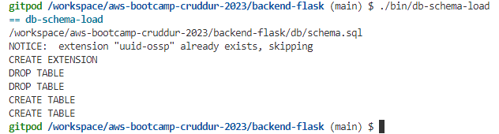

# Week 4 — Postgres and RDS

## Required Homework

### Create RDS Postgres Instance

- I created an RDS postgres instance using AWS CLI with the code below

```properties
aws rds create-db-instance \
  --db-instance-identifier cruddur-db-instance \
  --db-instance-class db.t3.micro \
  --engine postgres \
  --engine-version  14.6 \
  --master-username INPUTUSERNAME \
  --master-user-password INPUTPASSWORD \
  --allocated-storage 20 \
  --availability-zone us-east-1a \
  --backup-retention-period 0 \
  --port 5432 \
  --no-multi-az \
  --db-name cruddur \
  --storage-type gp2 \
  --publicly-accessible \
  --storage-encrypted \
  --enable-performance-insights \
  --performance-insights-retention-period 7 \
  --no-deletion-protection
```

- Im guessing we want the database to be persistent so we dont put it in the container so that the data doesnt go away once its stopped or restarted, thats why we use amazon RDS im guessing.

<b>Setup for local development</b>

```properties
export CONNECTION_URL="postgresql://<insert database username here>:<insert database password here>@localhost:5432/cruddur"
```

Setup env variables to avoid putting password everytime

```properties
gp env CONNECTION_URL="postgresql://<insert database username here>:<insert database password here>@localhost:5432/cruddur"
```

<b>Setup for production which is the RDS INSTANCE</b> 

```properties
export PROD_CONNECTION_URL="postgresql://<insert database username here>:<insert database password here>@<insert database name here>.<awsgeneratedid>.us-east-1.rds.amazonaws.com:5432/cruddur"
```

```properties
gp env PROD_CONNECTION_URL="postgresql://<insert database username here>:<insert database password here>@<insert database name here>.<awsgeneratedid>.us-east-1.rds.amazonaws.com:5432/cruddur"
```

### Create Schema for Postgres

- Created tables locally (activities and user table)

- Created Schema for Postgres

### Watched Ashish's Week 4 - Security Considerations	

There are 2 types of database
1. Relational Database: The tables and rows and colums are related, the data stored are linked kind of. Examples include: Mysql, postgresql,etc

2. Non Relational Database: The tables and rows are not linked whatsoever. Examples include: Nosql, DynamoDB, etc

- You want to make sure your database is secure because this is where your customers will have their data; from their passwords to their credit card information, etc. RDS should be in the user location, make sure you're using the right region for storing the data of the users. The database should NOT be publicly accessible. It should be multiple availability zones. Enable deletion protection so you or someone else dont mistakenly delete the database. Delete database you are no longer using.

- When you use Amazon Cognito to authenticate and authorize access via the JWT token which stores the claims in the payload and the header and the server signs the signature, the user is granted access and that data; username and password is stored in the database.

How do you link your data from the user poool in the Amazon Cognito to the Amazon RDS ??????????????????

<b>Amazon RDS Security best practices - AWS</b>

1. Use VPCs: Use Amazon VPC to create a private network for your RDS instance. This helps prevent unauthorized access to your instance from the public internet.

2. Compliance standard is what your business requires.

3. RDS Instances should only be in the AWS region that you are legally allowed to be holding user data in.

4. Use Amazon Organizations SCP - to manage RDS deletion, RDS creation, region lock, RDS Encrypted enforced etc. To control who has access to carry out these tasks

5. AWS Cloudtrail is enabled and monitored to trigger alerts on malicious RDS behaviour by an identity in AWS.

6. Amazon Guardduty is enabled in the account and region of RDS.

<b>Amazon RDS Security best practices - Application</b>

1. RDS instance to use appropriate Authentication - Use IAM authentication, kerberos etc (not the default).

2. Database User Lifecycle Management  - Create, modify, delete users.

3. AWS User Access Lifecycle Management -Change of Roles / Revoke Roles etc.

4. Security Group to be restricted only to known IPs.

5. Not have RDS to be internet accessible.

6. Encryption in Transit for comms between App & RDS.

7. Secret Management: Master User passwords can be used with AWS Secrets Manager to automatically rotate the secrets for Amazon RDS.

### Bash scripting for common database actions	

- bin stands for binary - put bashscripts with no extensions that will execute tasks such as create, drop, connect, seed, setup schema database.

- Created bin folder in the backendflask directory
added 3 files db-create, db-drop, db-schema-load

- Added the following code to the db-drop file
```bash
#! /usr/bin/bash
psql $CONNECTION_URL -c "DROP DATABASE cruddur;"
```

<b>Change file permissions</b>
```properties
chmod u+x bin/db-create
```
```properties
chmod u+x bin/db-drop
```

- Seeded local database


- Carried out schema load on database



- Dropped and created database


- Connected to local database 


### Install Postgres driver in backend application	

- Setup query so our app gets queries

- Its good practice to obscure id

- Logged into our postgress database and created a database, went into our backend folder and ran a script to create postgress extension

- Successfully connected to production database i.e rds on aws


### Connect Gitpod to RDS instance	

```properties
export DB_SG_ID="sg-000000"
gp env DB_SG_ID="sg-000000"
```

```properties
export DB_SG_RULE_ID="sgr-000000"
gp env DB_SG_RULE_ID="sgr-000000"
```

```properties
GITPOD_IP=$(curl ifconfig.me)
```
- Adjusted vpc security group to allow postgress from gitpod ip, by using the AWS CLI command below

```shell
aws ec2 modify-security-group-rules \
    --group-id $DB_SG_ID \
    --security-group-rules "SecurityGroupRuleId=$DB_SG_RULE_IDSecurityGroupRule={Description=GITPOD,IpProtocol=tcp,FromPort=5432,ToPort=5432,CidrIpv4=$GITPOD_IP/32}"
```
### Create AWS Cognito trigger to insert user into database	
- Started lamba integration 
- Added lamba code (this code is a python script)
- Added lamba code to lambda function created in aws and deploy
- Successfully integrated cognito with AWS Lamda and Rds, so the user data is showing in the rds database


### Create new activities with a database insert

- Implemented create activities endpoint

- Created a crud with the logged in user