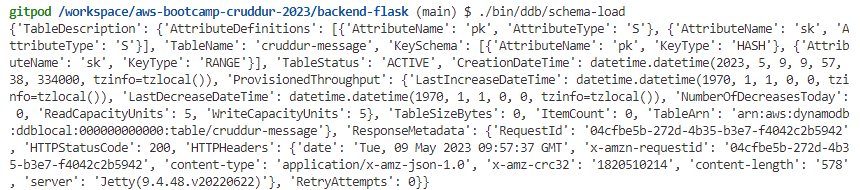
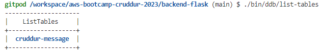
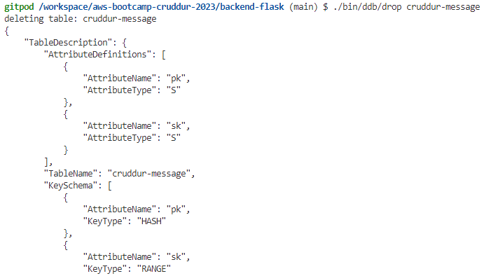

# Week 5 — DynamoDB and Serverless Caching

## Required Homework

### Watched Week 5 - Data Modelling (Live Stream)

- NOSQL database is at its best when you are trying to get it to where you are precomputing of what your application is trying to do, you are not asking questions of the data i.e query (I think... how many of this, what is this) all the answers you are looking for is precomputed and therefore it is fast and inexpensive and really scalable when you need it. 

- DynamoDB does not give you the hand holding, the nice looking ness other database do because those things end up affecting performance or cost.

- A big aspect of DynamoDB is the pre planning - what data do I need? When do I need it? and how quickly do I need it?

<b>Partition key and Sort Key</b>

In DynamoDB you have a primary key:
It can be a simple primary key which means it is just a partition key or it can be a composite primary key which means it means it has a partition key and a sort key.

- Partition key means what is the unique identifier for this item. It is going to dictate which partition DynamoDB puts it under the hood.

- The sort key is to uniquely identify that iten and it allows it to be sorted, you can then use substring logic on that sort key to work inside what's called an item collection.

- You can have multiple items with the same partition key but in the base table you have a partition key and a sort key makes it a unique item and then you can say get me all of the objects that have this partition key and begin with the word Andrew.

- GSI stands for global secondary Index
- LSI - local secondary index 

- LSI are always strongly consistent. Meaning once you insert something in the base table it is always in the local secondary index immediately because they are stored with the base table in the partition local secondary indexes are but they are not always appropriate for everything because LSIs require that you have the same partition key as the base table but you can have a different sort key so you can sort the data differently in an LSI and query the data different in an LSI than you could on a base table.  It’s the same data it’s just stored differently and therefore you can sort it and slice it up a little bit differently 

- GSIs are eventually consistent meaning that the data coming into the base table might take a couple milliseconds or however long for the data to get from the base table down to the GSI. It’s going to be consistent but it’s going to be eventually consistent so there might be a slight delay between the two. Most use cases being able to eventual consistency is just fine. With the GSI you can reslice the data however you want.

- LSI can only be created at table creation time, they cannot be added afterwards they cannot be deleted afterwards so you have to know upfront that that’s what you want and that’s what you’re going to use, there’s a couple limitations.

- In GSI it is not required for each of the items to be unique 

- Plan out data modelling for application, specifically for the messages.

- Successfully outputted the dynamodb table by running schema load 

- Show list of tables and made it look nice

- Deleted dynamodb table

- If you have an if statement that doesnt require an else, always put an else that throws an error. It is good practice.

- Defined access patterns
- Built utility scripts for Dynamodb
- Implemented Conversations with Dynamodb
- Setup dynamodb stream in order to update our message group
- We created a dynamodb table on aws through our shell
- Created vpc endpoint for dynamodb
- Create lambda function to hook dynamodb
- Create message is working!!

### Watched Ashish's Week 5 - DynamoDB Considerations

- If you’re trying to build internet scale applications that lots of people are using at the same time, you have performance at stake. And you want to have peak performance no matter what the scale of the audience is, unfortunately relational databases won’t cut it. Relational database require a lot more maintenance and with that performance becomes slow as it starts growing exponentially.

- Non relational databases have been proven to maintain performance irrespective of the workload 

- Amazon takes care of the maintenance, infrastructure of Dynamodb 

- The endpoint provided by amazon dynamodb is universal for that account i.e the URL is the same across each account but what would differ is the table youre trying to access

<b>Types of access to DynamoDB</b>

1. Internet gateway
2. VPC/Gateway Endpoints
3. DynamoDB Accelerator (DAX)
4. Cross Account roles

<b>Best practices - AWS</b>

1. Use VPC endpoints or private link option that allows you to have a private connection within the same AWS account. Use Amazon VPC to create a private network from your application or Lambda to a DynamoDB. This helps prevent unauthorized access to your instance from the public internet.

2. Compliance standard is what your business requires.

3. Amazon DynamoDB should only be in the AWS region that you are legally allowed to be holding user data in.

4. Amazon Organization SCP(Service Control Policy) - to manage DynamoDB Table deletion, DynamoDB creation, region lock etc

5. AWS Cloudtrail is enabled and monitored to trigger alerts on maicious DynamoDB behaviour by an identity in AWS.

6. AWS Config Rules (as no GuardDuty even in Mar 2023) is enabled in the account and region of DynamoDB.

7. Make sure deletion protection is turned on.

<b>Best practices - Application</b>

1. DynamoDB to use appropriate Authentication - Use IAM roles/AWS cognito identity pool - Avoid IAM Users/Groups. Becasue you want temporary credentials that will stop working after a certain period of time.

2. DynamoDB Lifecycle Management - Create, Modify, Delete Users. Make sure there are limited no. of users and the users should have minimum permisions.

3. AWS IAM roles instead of individual users to access and manage DynamoDB.

4. DAX Service (IAM) Role to have Read Only Access to DynamoDB (if possible).

5. Not have DynamoDB be accessed from the internet (use VPC Endpoints etc)

6. Site to Site VPN or Direct Connnect for Onpremise and DynamoDB Access.

7. Client side encryption is recommended by Amazon for DynamoDB. Dont use DynamoDB to store sensitive information. Use relational DBs to store sensitive information for long term storage. DynamoDB are more for fast reaction. 

