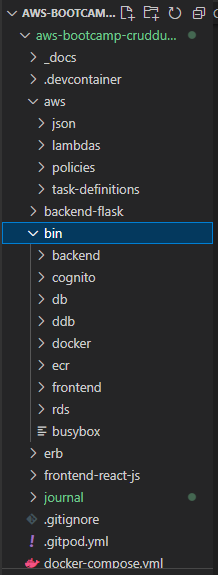

# Week 6 — Deploying Containers

## Required Homework

### Watch ECS Security by Ashish

<b>Types of container service in Aws</b>
1. Virtual machine - hosting a container on an actual server 
2. ECS, Fargate, EKS - managed container service on aws

<b>Types of launch types in AWS</b>
1. Amazon EC2 Architecture : If you have an EC2 instance where you want to deploy containers, you would have an auto scaling group which would help scale it up and down, you would also have a load balancer(elastic load balancer) in the the front. This load balancer would distribute traffic across the different ec2 instances(which would have containers within them im guessing).

2. Amazon ECS Architecture : you would still have the load balancer in the front BUT what you’re talking to is the ECS cluster. The ECS cluster can have a lot of EC2 instances that itself is managing .

So the cluster is managing the EC2 instances, you create a cluster and all the services within the cluster are managed by the ECS cluster while in the EC2 architecture, you’re managing the EC2 instances yourself, you’re deploying, you’re scaling up and scaling down yourself. 


3. ECS Fargate: It is used to deploy serverless container. You don’t have control over anything you don’t see the ec2 instances, you just basically see tasks running and Amazon manages the ec2 instances, the cluster, the service. You just define the tasks and IAM role. 

<b>What’s the difference between ECS EC2 and ECS Fargate? What do you have control over ?</b>

Fargate is a serverless compute solution. So it enables you to focus on container-level tasks, such as setting access controls and resource parameters, instead of more time-consuming tasks, like provisioning, setting up, updating, securing, and scaling clusters of Elastic Compute Cloud (EC2) servers or virtual machines. You don’t need to choose the right server types, manually scale instances, or patch many issues. AWS handles that on your behalf. Your primary focus is optimizing your code for optimal service delivery. This increases productivity, eases management, and optimizes operational costs.

#### Shared Risks with AWS ECS

<b>Traditional EC2 Instances</b> 

- USER manages 
1. Containerized applications
2. Container runtime 
3. Storage, loggings, monitoring plugins
4. Operating system 

- AWS manages 
1. Virtual machine 
2. Physical server 

<b>AWS Fargate</b>

- USER manages 
1. Containerized Applications

- AWS manages 
1. Container runtime
2. Storage, loggings, monitoring plugins 
3. Operating system
4. Virtual machine
5. Physical server 

<b>Security challenges with ECS Fargate</b>
- No Visibility of infrastructure 
- Ephemeral Resources make it hard to do triage(assessment) or forensics for detected threats 
- No file or network monitoring 
- Cannot run traditional security agents in Fargate (traditional security agents like what)
- User cannot run unverified container images 
- Containers can run as root and even with elevated privileges 

<b>Amazon ECS - Security Best Practices - AWS</b>

1. Cloud control plane configuration - Access Control, Container images, etc
2. Choosing the right public or private ECR for images 
3. Amazon ECR Scan Images to “Scan on Push” using Basic (Clair) or enhanced (Inspector + Snyk)
4. Use VPC endpoints or security groups with known sources only 
5. Compliance standard is what your business requires 
6. Amazon Organization SCP -create restrictions to manage ECS task deletion, ECS creation, region lock etc
7. Aws cloud trail is enabled and configured to trigger alerts on malicious ECS behavior by an identity in AWS
8. Aws config rules (as no guard duty (ECS) even in march 2023) is enabled in the account and region of ECS.


<b>Amazon ECS - Security Best Practices - Application</b>

1. Access control - Roles or IAM user for ECS clusters, services or tasks
2. Most recent version of ECR Agent daemon on EC2 
3. Container control plane configuration - root privileges, resource limitations, etc
4. No secrets/passwords in ECS task definitions e.g database password, etc consider AWS secret manager 
5. No secrets or passwords in container, consider AWS secret manager 
6. Only use trusted containers from ECR with no high or critical vulnerabilities 
7. Limit ability to SSH into EC2 container to read only file systems - use API or GitOps to pull information for troubleshooting 
8. Amazon cloud watch to monitor malicious ECS configuration changes 
9. Only use authorized container images 

### Watch Andrew Brown Live Class on Deploying Containers

We can deploy containers to- 
1. Lambda 
2. App runner
3. Elastic beanstalk 
4. ECS Fargate 
5. ECS EC2
6. Kubernetes 

### Provision ECS Cluster

<b>What is health check?</b>
Health check is a way of pinging something and saying are you working yes or no?

- Setup health check for flask app


* If you can Do NOT install or package networking tools (e.g wget,curl) or debugging tools into your container because if someone was to get into your container you make it easy for them to do abusive things 

- Created log group in cloudwatch

- Created an ECS cluster on AWS this would be used for managing the containers and Fargate would be used


### Create ECR repo and push image for backend-flask

* its not good to pull from docker hub when you have your own container registry like amazon ECR
\\\\ e.g having this FROM python:3:10-slim-buster in your docker file, it means you will have to pull this base image from dockerhub. If youre doing a lot of deployments sometimes docker hub will say you cant pull anymore images cos you've reached limit or network connectivity issues

`export ECR_PYTHON_URL="$AWS_ACCOUNT_ID.dkr.ecr.$AWS_DEFAULT_REGION.amazonaws.com/cruddur-python"`

- Created repository in the private ecr registry on AWS

- Pulled the base image for the backend flask image which is python:3:10-slim-buster

- Tagged the image and added the ecr repository link/name

- Pushed the image to amazon ecr

- replace the docker base image in the backend flask file with the amazon ecr image created

#### Deploy Backend Flask app as a service to Fargate

* IN AWS ECR tasks are for batch jobs that do the job and finish while services are great for long running stuff 

* Task defintion on aws is like our docker compose file 
in task definition you can have multiple containers but you do not want that because the containers(e.g frontend and backend) would be coupled together and everytime you deploy them they go together but you really want to be able to scale out just the backend or frontend separately. Im guessing its because you might want 2 containers(tasks) for the backend image and just one container(task) for the frontend image so putting them together doesnt give you that freedom.

* Task role is the permissions the container will have when its running
* Execution role is when you are trying to execute the container

* Network mode is set to vpc and it is recommended by aws for security purposes, easier service to service communication, one peculiar reason is that you get an ENI directly attached to your service(per service) which is very useful unlike using bridged or host network.

* For ECS Fargate you cant just choose whatever value you want for cpu and memory, they have to be of particular intervals. If you use the wrong combinations, it will not work.
* While for ECS EC2, you have more flexiblity you can make up random numbers, there are minimum and maximums but you can do alot more stuff

* When You have the network mode set to AWS VPC all you do is container port you dont need the host port. Because we would setup a load balancer and the load balancer target group is going to point to a port and that is how it is going to know which service to route to.

* DO NOT LEAVE YOUR ORIGINS TO THE INTERNET

- Created ecs cluster on AWS cli

- Create backend-flask service inside cluster via AWS Console

- Create backend-flask service inside cluster via AWS cli


- Setup load balancer(Application load balancer)


### Create ECR repo and push image for fronted-react-js and Provision and configure Application Load Balancer along with target groups

NOW WE DO FOR FRONTEND
- Updated task definitions
`aws ecs register-task-definition --cli-input-json file://aws/task-definitions/frontend-react-js.json`

- Tested if frontend production is working locally before pushing the image to AWS

- Built frontend image

```properties
docker build \
--build-arg REACT_APP_BACKEND_URL="http://cruddur-alb-****69.us-east-1.elb.amazonaws.com:4567" \
--build-arg REACT_APP_AWS_PROJECT_REGION="$AWS_DEFAULT_REGION" \
--build-arg REACT_APP_AWS_COGNITO_REGION="$AWS_DEFAULT_REGION" \
--build-arg REACT_APP_AWS_USER_POOLS_ID="us-east-1_8****" \
--build-arg REACT_APP_CLIENT_ID="2hg****" \
-t frontend-react-js \
-f Dockerfile.prod \
.
```

- Created frontend repository on aws for images

```properties
aws ecr create-repository \
  --repository-name frontend-react-js \
  --image-tag-mutability MUTABLE
```

- Logged in to ECR on terminal 

```properties
aws ecr get-login-password --region $AWS_DEFAULT_REGION | docker login --username AWS --password-stdin "$AWS_ACCOUNT_ID.dkr.ecr.$AWS_DEFAULT_REGION.amazonaws.com"
```

- Tagged image

`export ECR_FRONTEND_REACT_URL="$AWS_ACCOUNT_ID.dkr.ecr.$AWS_DEFAULT_REGION.amazonaws.com/frontend-react-js"`

`echo $ECR_FRONTEND_REACT_URL`

`docker tag frontend-react-js:latest $ECR_FRONTEND_REACT_URL:latest`

- Pushed image to aws

`docker push $ECR_FRONTEND_REACT_URL:latest`


### Deploy Frontend React JS app as a service to Fargate

- Registered/created task definition

`aws ecs register-task-definition --cli-input-json file://aws/task-definitions/frontend-react-js.json`

- Launched service first while detached from the loadbalancer(removed the load balancer configuration from the code)

- Created frontend service 

`aws ecs create-service --cli-input-json file://aws/json/service-frontend-react-js.json`

* You ALWAYS only run a SINGLE process as a container, one task or one containeer per process

- Frontend is working


### Manage your domain useing Route53 via hosted zone

NOW WE DO THE DOMAIN NAME

- Created hosted zone on route53
- Copied nameservers on route 53 to the nameservers where your domain is managed e.g namecheap, name.com, go daddy

### Create an SSL cerificate via ACM
* When setting up your ssl certificate it is recommended you add *.<your domain name> immediately

- Click on the certificate created, click create records in route 53

SETUP SSL
- request a certificate on aws certificate manager

### Setup a record set for naked domain to point to frontend-react-js and Setup a record set for api subdomain to point to the backend-flask

LOAD BALANCER
- Created a listener on the load balancer to redirect traffic from port 80 to port 443
- Created a listener on the load balancer to forward traffic from port 443 to the frontend target group, and added ACM certificate
- Deleted the previous listeners for port 3000 and 4567 which forwarded traffic to the frontend and backend target groups respectively
- Go to the port 443 listeners and manage the rules. Insert rule, add condition /host header/, add value /api.<yourdomainname>/, add action /forward to backend flask target group/. This makes the api (i.e api.mathidaduku.live) go to the backend and then mathidaduku.live go to the frontend


- Go to hosted zone created and create a record(A record with an alias routing traffic to the load balancer via simple routing)
- create a record for api.<domainname>(A record with an alias routing traffic to the load balancer via simple routing)

### Configure CORS to only permit traffic from our domain
- Go to task definitions/backendflask and update the environmental variables value with the domain for the backend and frontend.
- Updated task definitions on aws
- Logged into ecr
- Exported ecr frontend react url
- rebuild front end image and also replace the backend url with the api.domainnname

```properties
docker build \
--build-arg REACT_APP_BACKEND_URL="https://api.mathidaduku.live" \
--build-arg REACT_APP_AWS_PROJECT_REGION="$AWS_DEFAULT_REGION" \
--build-arg REACT_APP_AWS_COGNITO_REGION="$AWS_DEFAULT_REGION" \
--build-arg REACT_APP_AWS_USER_POOLS_ID="us-east-1_7***" \
--build-arg REACT_APP_CLIENT_ID="2f****" \
-t frontend-react-js \
-f Dockerfile.prod \
.
```

- Tagged and pushed the new image

- Redeploy the frontend and backend tasks on aws


### Secure Flask by not running in debug mode
So users wont see debug information in production

### Implement Refresh Token for Amazon Cognito
To prevent unnecesary timeout i think

### Refactor bin directory to be top level



### Configure task definitions to contain x-ray and turn on Container Insights
I DIDN'T TURN ON CONTAINER INSIGHTS BECAUSE IT WILL COST MONEY WHICH I DONT HAVE YET

### Change Docker Compose to explicitly use a user-defined network
- Network is now Crudder-net CONFIRMM????

### Using ruby generate out env dot files for docker using erb templates

I need to show messaging is working in production and also show home feed is working in production

### Create Dockerfile specfically for production use case
This is for us to run locally with newly defined env vars like the domain url

```dockerfile
FROM 18****.dkr.ecr.us-east-1.amazonaws.com/cruddur-python:3.10-slim-buster

# [TODO] For debugging, don't leave these in
#RUN apt-get update -y
#RUN apt-get install iputils-ping -y
# -----

# Inside Container
# make a new folder inside container
WORKDIR /backend-flask

# Outside Container -> Inside Container
# this contains the libraries want to install to run the app
COPY requirements.txt requirements.txt

# Inside Container
# Install the python libraries used for the app
RUN pip3 install -r requirements.txt

# Outside Container -> Inside Container
# . means everything in the current directory
# first period . - /backend-flask (outside container)
# second period . /backend-flask (inside container)
COPY . .

EXPOSE ${PORT}

CMD [ "python3", "-m" , "flask", "run", "--host=0.0.0.0", "--port=4567", "--no-debug", "--no-debugger", "--no-reload"]
```

```dockerfile
# Base Image ~~~~~~~~~~~~~~~~~~~~~~~~~~~~~~~~~~
FROM node:16.18 AS build

ARG REACT_APP_BACKEND_URL
ARG REACT_APP_AWS_PROJECT_REGION
ARG REACT_APP_AWS_COGNITO_REGION
ARG REACT_APP_AWS_USER_POOLS_ID
ARG REACT_APP_CLIENT_ID

ENV REACT_APP_BACKEND_URL=$REACT_APP_BACKEND_URL
ENV REACT_APP_AWS_PROJECT_REGION=$REACT_APP_AWS_PROJECT_REGION
ENV REACT_APP_AWS_COGNITO_REGION=$REACT_APP_AWS_COGNITO_REGION
ENV REACT_APP_AWS_USER_POOLS_ID=$REACT_APP_AWS_USER_POOLS_ID
ENV REACT_APP_CLIENT_ID=$REACT_APP_CLIENT_ID

COPY . ./frontend-react-js
WORKDIR /frontend-react-js
RUN npm install
RUN npm run build

# New Base Image ~~~~~~~~~~~~~~~~~~~~~~~~~~~~~~
FROM nginx:1.23.3-alpine

# --from build is coming from the Base Image
COPY --from=build /frontend-react-js/build /usr/share/nginx/html
COPY --from=build /frontend-react-js/nginx.conf /etc/nginx/nginx.conf

EXPOSE 3000
```

I need to show messaging is working in production and also show home feed is working in production but db is off for now